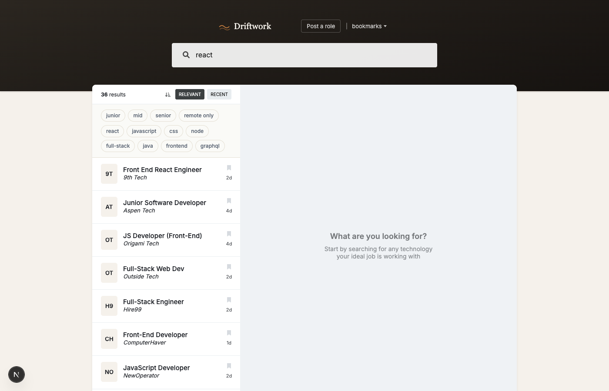
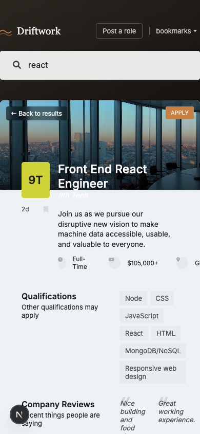

<div align="center">

<br />

# Driftwork

#### *Remote engineering jobs that find you.*

<br />

**[Live demo →](https://driftwork-sand.vercel.app/)**

<sub>
  <a href="#whats-interesting-here">Highlights</a>
  &nbsp;·&nbsp;
  <a href="#stack">Stack</a>
  &nbsp;·&nbsp;
  <a href="#quick-start">Quick start</a>
  &nbsp;·&nbsp;
  <a href="#deploy-vercel--prisma-postgres">Deploy</a>
  &nbsp;·&nbsp;
  <a href="#testing">Testing</a>
</sub>

<br /><br />

[](https://nextjs.org/)
[](https://react.dev/)
[](https://www.typescriptlang.org/)
[](https://www.prisma.io/)
[](https://www.postgresql.org/)
[](https://zod.dev/)
[](https://vitest.dev/)

<br />



<br />

</div>

> A curated job board for remote developer roles. Server-rendered list + detail, URL-driven search, client-side filters, a submit-a-role flow backed by zod-validated server actions, and a custom 404 — all on a single Next.js 16 App Router deploy against Prisma Postgres.

<br />

## What's interesting here

<table>
<tr>
<td width="33%" valign="top">

### App Router + parallel routes

Sidebar and detail pane are independent route segments. Clicking a job navigates to `/jobs/[id]?search=...` — a shareable URL with its own `generateMetadata` — while the sidebar stays mounted. Mobile swaps which pane is visible based on route.

</td>
<td width="33%" valign="top">

### RSC reads, Server Actions writes

List + detail fetches hit Prisma directly from RSC — no client cache, no HTTP round-trip, no loading spinner for first paint. "Post a role" posts to a zod-validated server action that `revalidatePath('/')` and `redirect`s on success.

</td>
<td width="33%" valign="top">

### URL as state

Search lives in `?search=`, the active job is the route segment. Back / forward, refresh, and sharing all work naturally — no state-hydration code.

</td>
</tr>
<tr>
<td width="33%" valign="top">

### Batched hydration

Bookmarks persist to `localStorage` and hydrate via a single `GET /api/jobs?ids=1,2,3` — one Prisma `findMany` — rather than N parallel requests.

</td>
<td width="33%" valign="top">

### A11y-first

axe-core reports **zero violations** across all routes. Keyboard nav, `aria-pressed` toggles, skip-to-content link, semantic landmarks, WCAG AA contrast.

</td>
<td width="33%" valign="top">

### Typed end-to-end, tested

Shared `JobItem` types in [`lib/type.ts`](lib/type.ts). Zod validates every route handler. Vitest covers the filter pipeline + schema — **32 tests in ~1s**.

</td>
</tr>
</table>

## Stack

| Layer | Choice |
|---|---|
| **Framework** | [Next.js 16](https://nextjs.org/) (App Router, Turbopack, React 19) |
| **Database** | [Prisma 5](https://www.prisma.io/) + [Prisma Postgres](https://www.prisma.io/postgres) via Vercel Marketplace |
| **State** | React Context (`Filter`, `Bookmarks`, `JobItems`) + URL search params |
| **Validation** | [Zod](https://zod.dev/) — schema shared between server action and client form |
| **Testing** | [Vitest](https://vitest.dev/) + [Testing Library](https://testing-library.com/) |
| **UI** | Vanilla CSS with design tokens, [Radix Icons](https://www.radix-ui.com/icons), `next/font` (Inter + Fraunces), `react-hot-toast` |
| **Hosting** | [Vercel](https://vercel.com/) — one deploy, one dashboard |

## Preview

| Desktop | Mobile |
|:--:|:--:|
|  |  |

## Quick start

Driftwork connects to Prisma Postgres through the Vercel Marketplace. Once the project is linked, one command pulls the connection string.

```bash
npm install
vercel link            # connect this repo to your Vercel project (once)
vercel env pull .env   # pull DATABASE_URL from the Marketplace integration
npm run db:push        # create schema on your DB
npm run db:seed        # seed from prisma/data (50 jobs)
npm run dev            # → http://localhost:3000
```

**Try it:** type `react` / `python` / a company name · click a job (URL becomes `/jobs/[id]?search=...`) · refresh (fully hydrated) · stack a `senior` + `TypeScript` filter · bookmark a couple jobs and refresh · use **Post a role** to submit a new job — appears in search immediately.

## Testing

```bash
npm test              # run the 32-test suite once (~1s)
npm run test:watch    # watch mode
```

Covered surfaces:

| File | Tests | Covers |
|---|:--:|---|
| [`test/schemas.test.ts`](test/schemas.test.ts) | 13 | zod salary normalization, validation rules |
| [`test/filters.test.ts`](test/filters.test.ts) | 14 | filter / sort / paginate pipeline |
| [`test/JobList.test.tsx`](test/JobList.test.tsx) | 4 | list render + active highlight + search-param preservation |

## API

| Endpoint | Purpose |
|---|---|
| `GET /api/jobs?search=<term>` | Fuzzy-matches title, company, tags |
| `GET /api/jobs?ids=id1,id2,...` | Batched detail fetch (bookmarks hydration) |
| `GET /api/jobs/:id` | Single job detail |

All responses share the same shape (`{ public, jobItems }` or `{ public, jobItem }`) that the RSC consumers also receive directly from Prisma.

## Deploy (Vercel + Prisma Postgres)

Frontend, API routes, and database all live on Vercel — one dashboard, one deploy.

<ol>

<li>

**Push to GitHub.**

</li>

<li>

**Import the repo on Vercel** — Next.js is auto-detected, first build succeeds.

</li>

<li>

**Provision Prisma Postgres** from the Vercel Marketplace:

```bash
vercel link
vercel integration add prisma-postgres
```

Injects `DATABASE_URL` (plus mirrored `POSTGRES_URL` and `PRISMA_DATABASE_URL` aliases) into every environment — Production, Preview, Development.

</li>

<li>

**Bootstrap the schema + seed** once, from local:

```bash
vercel env pull .env
npx prisma db push
npm run db:seed
```

</li>

<li>

**Redeploy** (or push to `main`). The build picks up `prisma generate` via the `postinstall` hook and connects through `DATABASE_URL` at runtime.

</li>

</ol>

After the initial seed, subsequent deploys don't need any manual DB steps.

<details>
<summary><strong>Project layout</strong></summary>

```
.
├── app/
│   ├── layout.tsx                  # root: providers + header + <main>
│   ├── (main)/                     # route group for list + detail
│   │   ├── layout.tsx              # adds Container with parallel @detail slot
│   │   ├── page.tsx                # RSC: fetches list by ?search
│   │   ├── jobs/[id]/page.tsx      # sidebar when on a detail URL (+ metadata)
│   │   └── @detail/
│   │       ├── default.tsx         # "pick a job" empty state
│   │       ├── loading.tsx         # detail skeleton
│   │       └── jobs/[id]/page.tsx  # RSC: fetches detail
│   ├── submit/                     # post-a-role form + server action
│   ├── api/jobs/                   # route handlers
│   ├── not-found.tsx               # custom 404
│   └── globals.css                 # design tokens + component styles
│
├── components/                     # Presentational + client islands
├── context/                        # FilterContext, BookmarksContext, JobItemsContext
├── lib/
│   ├── services/jobService.ts      # Prisma calls
│   ├── db.ts                       # PrismaClient singleton + BigInt shim
│   ├── schemas.ts                  # zod schemas (shared server/client)
│   ├── filters.ts                  # pure filter / sort / paginate
│   ├── hooks.ts                    # useDebounce, useLocalStorage, ...
│   └── type.ts                     # single source of truth for types
├── test/                           # Vitest suites
└── prisma/
    ├── schema.prisma               # JobItem model
    ├── seed.ts                     # seeds from prisma/data/*.json
    └── data/                       # 50 curated jobs + expanded details
```

</details>

<details>
<summary><strong>Implementation notes</strong></summary>

- Job IDs are stored as `TEXT` — the seeded dataset includes values that exceed `int8` range. They coerce to `Number` at the API boundary, matching `JobItem.id: number`.
- `remote` is randomized at seed time so the filter toggle does something meaningful (~80% remote, ~20% hybrid).
- `useLocalStorage` is SSR-safe — the lazy initializer only reads `localStorage` on the client, avoiding hydration mismatch.
- The Prisma singleton in [`lib/db.ts`](lib/db.ts) stashes the client on `globalThis` to survive Next.js HMR and serverless cold starts without exhausting the connection pool.
- Mobile route-mode is wired via a small client component ([`components/RouteMode.tsx`](components/RouteMode.tsx)) that sets `body[data-route]` from `usePathname()` — CSS swaps which pane (sidebar vs detail) is visible without a layout refactor.

</details>

<br />

<div align="center">
  <sub>Built by <a href="https://github.com/HariYenuganti">Hari Yenuganti</a>.</sub>
</div>
